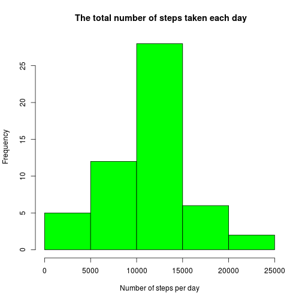
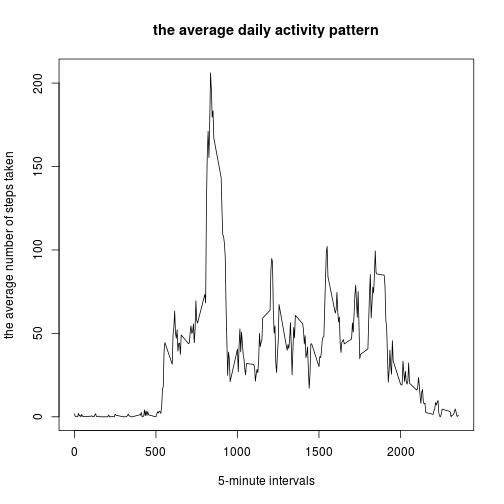
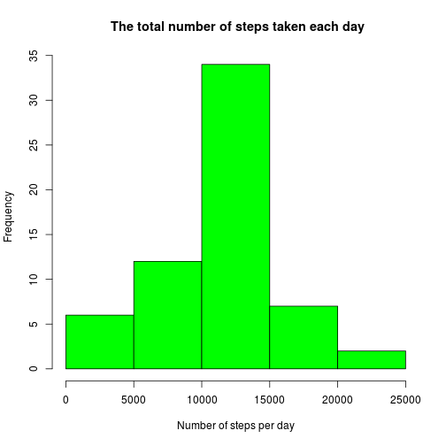
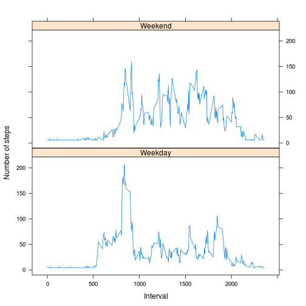

## Activity monitoring report 

### The data were collected from a personal activity monitoring device and are available on the web. The device collects data at 5 minute intervals through out the day. The data consists of two months of data from an anonymous individual collected during the months of October and November, 2012 and include the number of steps taken in 5 minute intervals each day.

### Let's download the data, unzip them and write to R-object:


```r
download.file("https://d396qusza40orc.cloudfront.net/repdata%2Fdata%2Factivity.zip", "activity.zip")
unzip("activity.zip", "activity.csv")
dt <- read.csv("activity.csv")
```


### As a next step let's summ up the number of steps per day:

```r
head(dt)
```

```
##   steps       date interval
## 1    NA 2012-10-01        0
## 2    NA 2012-10-01        5
## 3    NA 2012-10-01       10
## 4    NA 2012-10-01       15
## 5    NA 2012-10-01       20
## 6    NA 2012-10-01       25
```

```r
library(data.table)
dt <- as.data.table(dt)
dt1 <- dt[,list(st_day=sum(steps)),by=date]
```

### and calculate basic statistics such as mean and median of the total number of steps taken per day


```r
sta1 <- c(mean(dt1$st_day, na.rm = T),median(dt1$st_day, na.rm = T))
```
### Now let's visualize our data and build the histogram of the total number of steps taken each day 


```r
hist(dt1$st_day, 
     main = " The total number of steps taken each day", 
     xlab = "Number of steps per day", 
     col = "green")
```



### Ok, let's check if the average daily activity pattern can tell us something more about our data. First of all let's count the average number of steps per each day interval


```r
av_steps_interval <- aggregate(steps~interval, data = dt, mean)
```
### and visualise the average daily acivity pattern:

```r
plot(av_steps_interval$interval, av_steps_interval$steps, type = "l", 
     main = "the average daily activity pattern",
     xlab = "5-minute intervals", 
     ylab = "the average number of steps taken")
```



### As we expected the average number of steps is different during the day. But what is the 5-minuts interval with the maximum average value?

```r
which(av_steps_interval$steps==max(av_steps_interval$steps))
```

```
## [1] 104
```

```r
av_steps_interval[104,"interval"]
```

```
## [1] 835
```

### Probably on some days the owner forgot to wear the fit bracelet. let's count the number of missing values:

```r
sum(is.na(dt$steps))
```

```
## [1] 2304
```

### Ok, that's a lot. Let's see what we can do about the missing values:

#### let's count mean value for steps per day and replace missing values 

```r
dt <- as.data.table(dt)
dt2 <- dt[,list(steps=steps, date=date, st_av=mean(steps, na.rm = T), 
                interval=interval),by=date]
dt2$steps[is.na(dt2$steps)] <- dt2$st_av
```

```
## Warning in dt2$steps[is.na(dt2$steps)] <- dt2$st_av: number of items to
## replace is not a multiple of replacement length
```

### one more check if we still have some missing values in our data set:

```r
any(is.na(dt2$steps))
```

```
## [1] TRUE
```

```r
head(dt2)
```

```
##          date steps       date st_av interval
## 1: 2012-10-01   NaN 2012-10-01   NaN        0
## 2: 2012-10-01   NaN 2012-10-01   NaN        5
## 3: 2012-10-01   NaN 2012-10-01   NaN       10
## 4: 2012-10-01   NaN 2012-10-01   NaN       15
## 5: 2012-10-01   NaN 2012-10-01   NaN       20
## 6: 2012-10-01   NaN 2012-10-01   NaN       25
```
### Yes, apparently, we don't have any data about the first day. 

```r
dt2$steps[is.na(dt2$steps)] <- mean(dt2$steps, na.rm = T)
```
### total number of steps per day

```r
dt3 <- dt2[,list(st_day=sum(steps)),by=date]
```
### build the histogram

```r
hist(dt3$st_day, 
     main = " The total number of steps taken each day", 
     xlab = "Number of steps per day", 
     col = "green")
```


### calculate mean and median of the total number of steps taken per day

```r
sta2 <- c(mean(dt3$st_day, na.rm = T),median(dt3$st_day, na.rm = T))
```
### compare with the previous mean and median

```r
sta <- cbind(sta1, sta2)
rownames(sta) <- c('mean','median')
sta
```

```
##            sta1     sta2
## mean   10766.19 10744.59
## median 10765.00 11015.00
```
### As we can see, the estimates of the total daily number of steps have increased.

### Are there some differences in activity patterns between weekdays and weekends? To answer this question let's add a new factor value "weekend" with 2 level "weekend" and "weekday". But before to do so we add column "day" and save the weekday names to it using weekdays() function:


```r
dt2$day <- weekdays(as.Date(dt2$date))

dt2$weekend <- as.factor(ifelse(dt2$day == "Saturday"|dt2$day == "Sunday", 
                                c("Weekend"), c("Weekday")))
```
### and save our finding to the new dataframe

```r
av_steps_interval2 <- aggregate(steps~interval+weekend, data = dt2, mean)
```
### To visualize the activity difference on weekend and weekdays let's build the panel plot

```r
library(lattice)

xyplot(steps ~ interval| factor(weekend), 
       data = av_steps_interval2,
       type = "l",
       xlab = "Interval",
       ylab = "Number of steps",
       layout=c(1,2))
```



